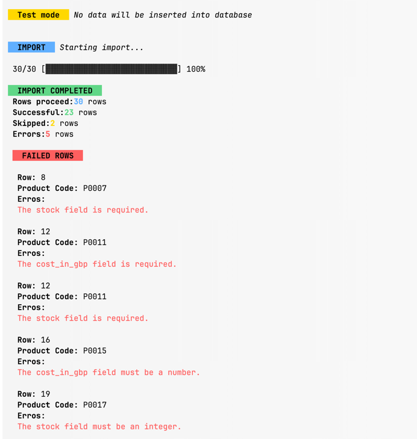

# MONSTER IMPORTER

## About the project

This project is console application. Mechanism which reads a file from command line. The file contains a list of
products. The program will read the file and
import the products into a database.

### Libraries used

- [Laravel zero](https://laravel-zero.com/)
- [Laravel Excel](https://laravel-excel.com/)

#### Example of application execution



Example file is located in `storage` folder.

## Run the project locally using development server

1. Clone the repository
2. Run `composer install`
3. Setup database in `.env` file
4. Run `php artisan migrate`
5. Run `php artisan import:products <path_to_file>` where `<path_to_file>` is the path to the file you want to import

## Build standalone application

1. Clone the repository
2. Run `composer install`
3. Setup database in `.env` file
4. Run `php artisan migrate`
5. Run `php artisan app:build <application_name>` to build the application
6. Run `./build/<application_name> import:products <path_to_file>` where `<path_to_file>` is the path to the file you want to import

## Development

### Linting

```bash
composer lint
```

### Testing

```bash
composer test
```

## How to import products

#### Supported format

Run the following command:

```bash
php artisan import:products <path_to_file>
```

_change `<path_to_file>` to the path of the file you want to import_

### Rule of importing products

- The file must be a CSV file
- The file must have the following columns:
    - Product Code
    - Product Name
    - Product Description
    - Stock
    - Cost in GBP
    - Discontinued
- Rows with cost in GBP less than 5 will be ignored and stock less than 10 will be ignored
- Any item with cost more than 1000 will be ignored
- Items marked as discontinued will be imported, but will have the discontinued date set as the current date.
- Failed imports will be logged.

## Enhancements

- [ ] Add support for other file formats (e.g. XLSX, ODS)
- [ ] Add queue support for importing products for large files
- [ ] Add support for importing products from a URL
- [ ] Add support for exporting products from a database
- [ ] Add a validation service to ensure file integrity before processing, checking headers, encoding, and formatting.
- [ ] Include reporting/logging to capture errors and warnings associated with invalid or suspect entries for later review.

## License

This project is licensed under the MIT License - see the [LICENSE.md](LICENSE.md) file for details
